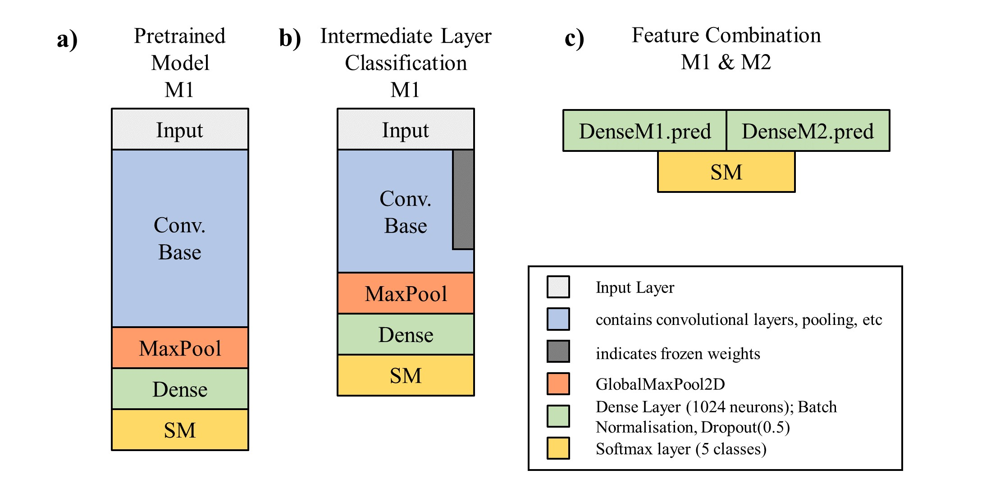

# Deep Cervical Cancer

## Summary
Deep Cervical Cancer (DCC) is a CNN based image classification model capable of predicting what type of cell anomalies are apparent in a Pap-smear test, and could thus be used to assist medical professionals in a large scale screening effort for cervical cancer.\
Part of a project for the 'Deep Learning' class at ETH in HS19.

## Key Challenge
A high quality but low N dataset was used to train and evaluate the DCC model - the training set (60% split) comprised only 580 images. Due to the complexity of the task, a model of sufficient complexity was required, making learning without overfitting hard with such a small dataset. Thus, reaching an optimal degree of generalization was the main challenge of this project. This issue was addressed a.o. with the following methods:
* data augmentation, to a similar degree as the variation observed in the dataset
* using pretrained models, offering high model complexity while requiring comparatively little training 
* most parameters of the pretrained models were kept frozen, and the higher layers (thought to be less general, and more dataset specific) discarded 
* combining features extracted from both the VGG16-based and ResNet50-based models - conceptually somewhat similar to ensembling.
* high dropout rates, early stopping - common ANN regularization techniques.

## Model and training procedure
The DCC model builds on two CNN models with Imagenet pre-trained weights (ResNet50, VGG16; see Figure a) ). For both pretrained models, approximately the upper third of layers is discarded and a dense network added on top. The weights of the original pre-trained model are kept frozen except for the last retained CNN layer (Figure b)). Both modified models are then in a first step trained separately. Then, for every image the activation values at the last layer before the softmax layer of both models are predicted, concatenated and used as a new dataset (Figure c) ). This new, 2048-dimensional input is then directly connected to a softmax layer, with a very high dropout rate in between, and trained again.


## Results
The obtained test set accuracies are 83% for the modified ResNet50, 89% for the modified VGG16, and 92% for the combined model. This is still noticeably lower than values reported on the same dataset; 95% in Plissiti et al. (2018) and 96% in Kiran et al. (2019), though it is not entirely clear if the comparison is valid.\
The pronounced perfomance increase observed by combining the two models is particularly interesting and suggests that the approach of combining pretrained models for low N dataset tasks might be promising.\
For medical application it may be more sensible to use a more domain-specific performance metric e.g. penalizing false positives less in the high cancer risk classes.

## Setup
The model is compatible with `Keras 2.3.1` and `tensorflow 2.0.0`. The data used are the unsegmented images of the 'SIPaKMeD' database which can be downloaded at http://www.cs.uoi.gr/~marina/sipakmed.html. The dataset categorizes the images into five cell classes with varying risk for developing cervical cancer and was described in Plissiti et al. (2018).\
The format required for the data folder is as follows:
```
sipakmed_formatted
├── train
│   ├── im_Dyskeratotic
│   ├── im_Koilocytotic 
│   ├── im_Metaplastic 
│   ├── im_Parabasal  
│   └── im_Superficial-Intermediate
├── val
│   ├── im_Dyskeratotic
│   ├── im_Koilocytotic 
│   ├── im_Metaplastic 
│   ├── im_Parabasal  
│   └── im_Superficial-Intermediate
├── test
│   ├── im_Dyskeratotic
│   ├── im_Koilocytotic 
│   ├── im_Metaplastic 
│   ├── im_Parabasal  
│   └── im_Superficial-Intermediate
```
After installing the dataset in the correct setup, and cloning the repository, the model can simply be run from the command line:
```
python main.py --model combined --data_path path_2_folder/sipakmed_formatted/
```
(For the `--model` argument, it is also possible to just train the modified VGG16 / ResNet50 instead of the full model, cf help function.)

### References
* Plissiti, M. E., Dimitrakopoulos, P., Sfikas, G., Nikou, C., Krikoni, O., & Charchanti, A. (2018, October). SIPAKMED: A new dataset for feature and image based classification of normal and pathological cervical cells in Pap smear images. In 2018 25th IEEE International Conference on Image Processing (ICIP) (pp. 3144-3148). IEEE.

* Kiran, G. V., & Meghana Reddy, G. (2019). Automatic Classification of Whole Slide Pap Smear Images Using CNN With PCA Based Feature Interpretation. In Proceedings of the IEEE Conference on Computer Vision and Pattern Recognition Workshops (pp. 0-0).

### Acknowledgements
I am grateful to Christos Antoniou (https://github.com/cantonioupao), for the idea of working on the cervical cancer classification task and with whom the project concept was developed.
